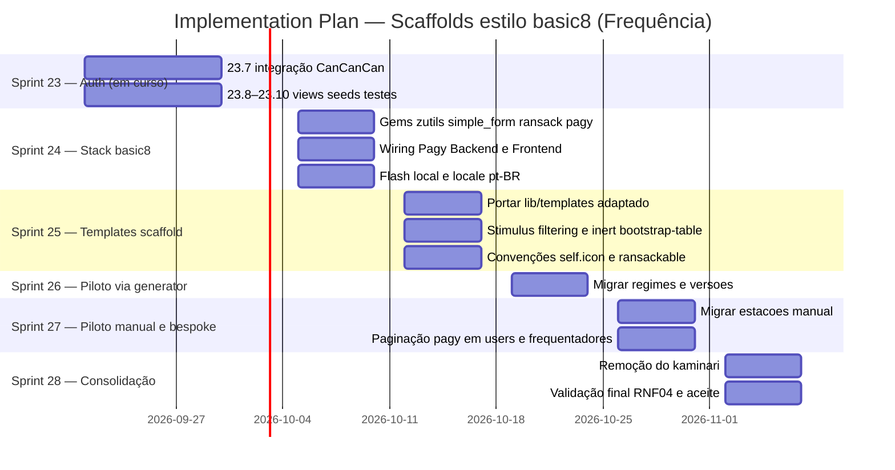

# Implementation Plan — Frequência: Scaffolds/CRUD no estilo basic8

> Versão: 1 | Data: 2026-09-21 | Total de sprints: 5 (Sprints 24–28; Sprint 23 em curso)
> Fonte: `docs/PRD-SCAFFOLD-ESTILO-BASIC8.md` (RF01–RF14, RN01–RN06, RNF01–RNF06, D1–D6)
> Encadeamento: inicia **após a tarefa 23.7** (Sprint 23 — integração CanCanCan nos controllers)

## Visão Geral

Padronizar a geração de CRUDs administrativos do Frequência no estilo do app de referência `basic8`: adoção das gems `zutils ~> 4.0` (partials `shared/*`), `simple_form ~> 5.4`, `ransack ~> 4.4` e `pagy ~> 9`; portar para `lib/templates/` um template de scaffold que gera controller herdando `Admin::ApplicationController` com `load_and_authorize_resource` + `ransack` + `@pagy, @collection = pagy(...)` + notices pt-BR; provar o template num **piloto (P2)** migrando `regimes`/`versoes` (via generator) e `estacoes` (manual) para o novo estilo; trocar **somente a paginação** de `users`/`frequentadores` para pagy (exceção bespoke RN02); e **remover o kaminari** ao final, consolidando pagy como dependência única. Nenhuma alteração em auth/banco (RNF06) — o plano é sequenciado para não conflitar com a Sprint 23 em andamento.

## Diagrama Gantt

## Épicos

### Épico 1 — Stack basic8 (gems + configuração)

Adoção das gems de referência e exposição do pagy no stack admin. Instala `zutils`, `simple_form`, `ransack` e `pagy`; gera o initializer do simple_form (wrapper Bootstrap 5 + locale pt-BR); expõe `Pagy::Backend` no `Admin::ApplicationController` e `Pagy::Frontend` no `ApplicationHelper`; mantém o flash local do layout admin (RF14) sem adotar partials `shared/flash*`. Não altera auth/banco (RNF06).

- Sprints: 24

### Épico 2 — Templates de scaffold e convenções de modelo

Porta para `lib/templates/` os templates do basic8 **adaptados ao Frequência** (controller herda `Admin::ApplicationController`, `load_and_authorize_resource` + `ransack(params[:q])` + `@pagy, @collection = pagy(...)` + notices pt-BR; `index`/`new`/`edit`/`show` renderizam partials `shared/*`). Garante o funcionamento do gerador flat (`rails g scaffold Modelo` → `Admin::` + views em `admin/` + rotas manuais no `scope module: "admin"`). Cria o controller Stimulus local `filtering`, parametriza o inert do `bootstrap-table` (RF12) e define as convenções de model `self.icon` + whitelist `ransackable_*` (RN04).

- Sprints: 25

### Épico 3 — Piloto P2 e consolidação (single-gem pagy)

Prova o template e unifica a paginação. Migra `regimes`/`versoes` para o novo estilo **via generator**, `estacoes` **manualmente** (mesmos partials — model `EstacaoPonto` não casa com scaffold); troca **somente a paginação** de `users`/`frequentadores` para pagy (RN02 — exceção bespoke documentada); remove o kaminari do Gemfile e apaga `app/views/kaminari/`; valida a suíte completa (RNF04) e os critérios de aceite do PRD.

- Sprints: 26, 27, 28

## Sprints

### Sprint 24 — Stack basic8 (gems + wiring)

- Goal: Adotar as gems de referência (zutils, simple_form, ransack, pagy) e expor o pagy no stack admin sem alterar auth/banco.
- Escopo macro: Gemfile com `zutils ~> 4.0`, `simple_form ~> 5.4`, `ransack ~> 4.4`, `pagy ~> 9` + bundle; `simple_form:install` com wrapper Bootstrap 5 e locale pt-BR; `include Pagy::Backend` no `Admin::ApplicationController` e `include Pagy::Frontend` no `ApplicationHelper`; validação de compatibilidade Rails 8.0.4 API-only e do flash local (RF14); smoke test de carga das gems (`zeitwerk`, suíte baseline).
- Dependências: **Conclusão da tarefa 23.7** (Sprint 23) — integração CanCanCan nos controllers. Nenhuma sprint da feature inicia antes do merge da 23.7 para não conflitar em `Admin::ApplicationController`/controllers admin.
- Estimativa: 1 semana
- RFs cobertos: RF01, RF02, RF03, RF14

### Sprint 25 — Templates de scaffold + convenções de modelo

- Goal: Portar os templates do basic8 adaptados ao Frequência e validar o gerador flat com as convenções de modelo (RN04).
- Escopo macro: `lib/templates/rails/scaffold_controller/controller.rb.tt` adaptado (herda `Admin::ApplicationController`, `load_and_authorize_resource` + ransack + pagy + notices pt-BR) e `lib/templates/erb/scaffold/*` (`index`, `new`, `edit`, `show`, `partial`) renderizando `shared/*`; prova de conceito `rails g scaffold Modelo` (flat → `Admin::` + rotas manuais no `scope module: "admin"`); controller Stimulus local `filtering` registrado no importmap; `shared/index` com `controller: ""` (inert bootstrap-table); `zutils.scss` NÃO importado (RF13); documentação da convenção `self.icon` + whitelist `ransackable_*` (RN04/RF06/RF07).
- Dependências: Sprint 24
- Estimativa: 1 semana
- RFs cobertos: RF04, RF05, RF06, RF07, RF11, RF12, RF13

### Sprint 26 — Piloto P2: regimes e versoes (via generator)

- Goal: Migrar `regimes` e `versoes` para o novo estilo através do scaffold padronizado, comprovando o template em casos reais.
- Escopo macro: regenerar controllers/views de `regimes`/`versoes` com o template (model flat e rotas flat preservados); aplicar `self.icon` e `ransackable_*` nos models `Regime`/`Versao`; ajustar `search_fields` por model (default `id_eq` do zutils); validar CRUD admin funcional com `load_and_authorize_resource` (create/update/destroy restritos a admin) e busca ransack; validar `shared/index` inert sem bootstrap-table.
- Dependências: Sprint 25
- Estimativa: 1 semana
- RFs cobertos: RF08 (parcial — regimes/versoes), RF06, RF07 (aplicação nos pilotos)

### Sprint 27 — Piloto P2: estacoes manual + paginação pagy em users/frequentadores

- Goal: Migrar `estacoes` manualmente no mesmo estilo e trocar a paginação de `users`/`frequentadores` para pagy, preservando os recursos bespoke.
- Escopo macro: reescrever `admin/estacoes` com os mesmos partials/padrões (model `EstacaoPonto` — naming não casado com scaffold), comportamento e permissões preservados; `@pagy, @vinculos = pagy(...)` nos controllers de `users`/`frequentadores` e `pagy_info`/`pagy_nav` nas views, removendo `paginate`/`total_count`/`offset_value`/`.page(` (RN02 — telas bespoke preservadas e exceção documentada no código); aplicar `self.icon`/`ransackable_*` no model `EstacaoPonto`.
- Dependências: Sprint 26
- Estimativa: 1 semana
- RFs cobertos: RF08 (parcial — estacoes/manual), RF09, RF06, RF07 (aplicação em EstacaoPonto)

### Sprint 28 — Remoção do kaminari + validação final

- Goal: Consolidar pagy como dependência única de paginação e validar os critérios de aceite do PRD (RNF04).
- Escopo macro: remover gem `kaminari` do Gemfile + `bundle install`; apagar `app/views/kaminari/`; varrer o app por resíduos (`paginate`, `.page(`, `total_count`, `offset_value`); rodar suíte completa (`bin/rails test` verde — baseline 644 testes/1 falha pré-existente de timezone), `rails zeitwerk:check` e rubocop nos arquivos novos/alterados; checagem final dos critérios de aceite 1–8 do PRD e da ausência de regressão em auth/ability (RNF06).
- Dependências: Sprint 27
- Estimativa: 1 semana
- RFs cobertos: RF10; valida RF09/RF08/RF04/RF05/RF11/RF12 (aceite) e RNF04/RNF06

## Decisões Arquiteturais

As decisões técnicas da feature foram fechadas no PRD (registro D1–D6) e são adotadas pelo plano sem reabertura:

| # | Decisão | Escolha |
|---|---------|---------|
| D1 | Origem dos partials `shared/*` | Gem `zutils` 4.0.0 (engine) — convenção `Model.icon`, helpers via `ActionView::Base`, JS controllers locais, sem `zutils.scss` |
| D2 | Gems de formulário/busca | `simple_form ~> 5.4` + `ransack ~> 4.4`; initializer wrapper BS5 + locale pt-BR; whitelist `ransackable_*` |
| D3 | Paginação | `pagy ~> 9` — `@pagy, @collection = pagy(...)`; kaminari removido ao final do piloto |
| D4 | Namespace | Opção A — scaffold flat + template customizado; controller herda `Admin::ApplicationController`; views em `admin/`; rotas flat no `scope module: "admin"`; model flat |
| D5 | Coexistência | P2 — estacoes/regimes/versoes no novo estilo; users/frequentadores só paginação pagy; kaminari removido; sem override da zutils; bespoke = exceção documentada |
| D6 | Compatibilidade Rails 8.0.4 + API-only | Compatível — `Pagy::Backend`/`Frontend`, flash local mantida, filtering local, bootstrap-table inert |

**Decisão de planejamento — encadeamento com a Sprint 23 (nova):** a implementação do padrão de scaffolds **somente inicia após a tarefa 23.7** (integração CanCanCan nos controllers). Motivo: RF04/RF05 exigem `load_and_authorize_resource` no template e a Sprint 24 expõe o `Pagy::Backend` no `Admin::ApplicationController` — mesma região de código da 23.7 (controllers admin). Sequenciar evita conflito de merge e respeita RN06 (zero regressão em auth/ability). As Sprints 24–28 não alteram a matriz de permissões do Sprint 23 (RN05).

## Riscos do Projeto

| Risco | Severidade | Mitigação |
|---|---|---|
| Convivência com Sprint 23 (23.7–23.10 pendentes) — merge/sobreposição em controllers admin | 🟡 | Nenhuma sprint da feature antes do merge da 23.7; piloto respeita a matriz de permissões existente (RN05/RNF06) |
| Regressão nas telas bespoke (users/frequentadores) na troca de paginação | 🟡 | Escopo mínimo (só paginação); suíte cobre `?page=`; validação manual + exceção RN02 documentada |
| Divergência da migração manual de `estacoes` vs template gerado | 🟢 | Mesmos partials/padrões; revisão de conformidade no piloto |
| Gem externa `zutils` em evolução (futuros upgrades) | 🟢 | Pin `~> 4.0`; helpers já portados parcialmente (`eval_with_rescue`/`menu_activated?`) |
| `bootstrap-table` inert sem JS (ordenação client-side ausente) | 🟢 | `sort_all` roda server-side via `sort_link` (ransack) — sem perda funcional |
| `pagy_bootstrap_nav` (visual BS5) — zutils usa `pagy_nav` puro | 🟢 | Avaliar extra/override visual na implementação (Sprint 26/27); não bloqueia |
| Baseline de testes com 1 falha pré-existente de timezone | 🟢 | Documentada; aceite RNF04 = sem **novas** falhas |